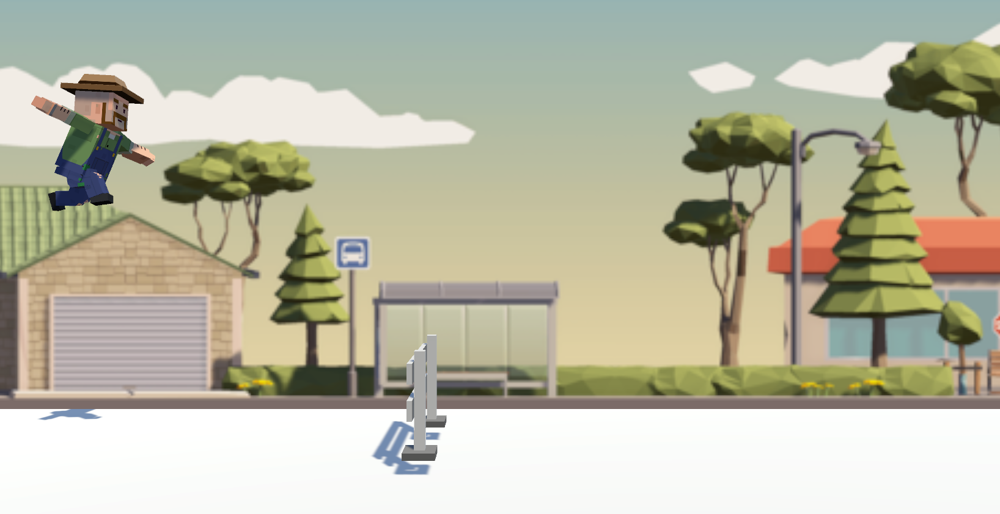

# Platform Runner 🏃‍♂️

## About the Game
**Platform Runner** is a simple 2D Unity platformer that demonstrates the basics of creating a running and jumping game.  
It introduces concepts like **animation**, **colliders**, **rigidbody physics**, and **MonoBehaviour scripts**.

---

## Features
- Smooth running and jumping
- Simple, fun, and easy to learn

